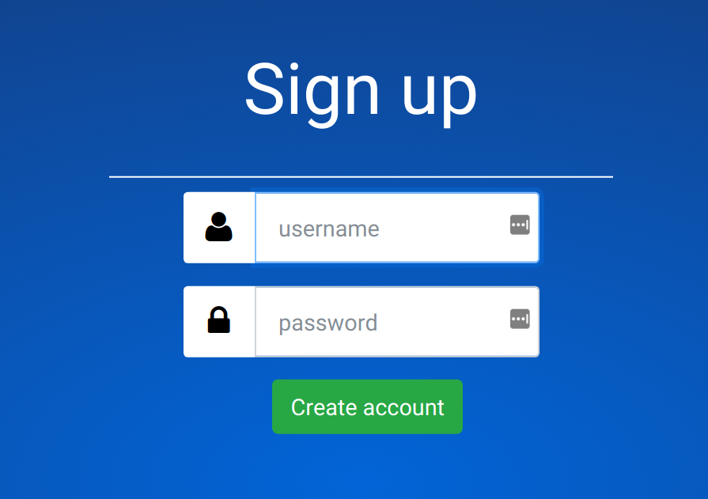
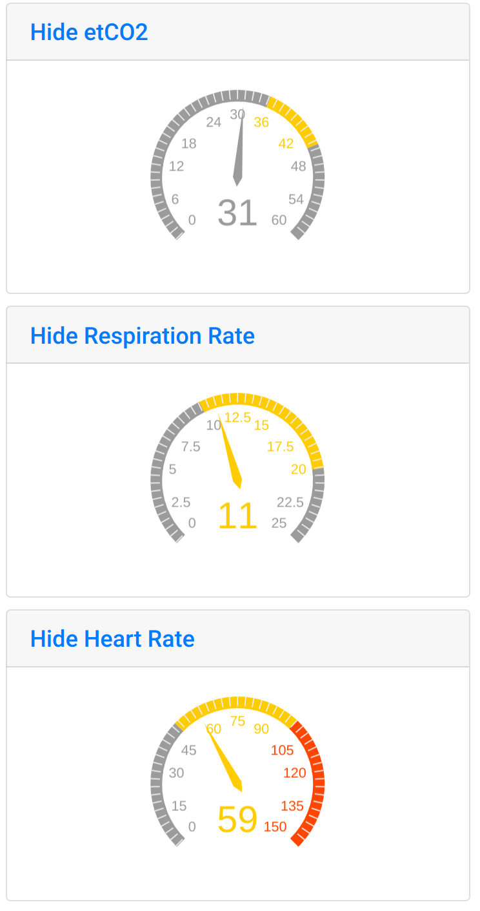
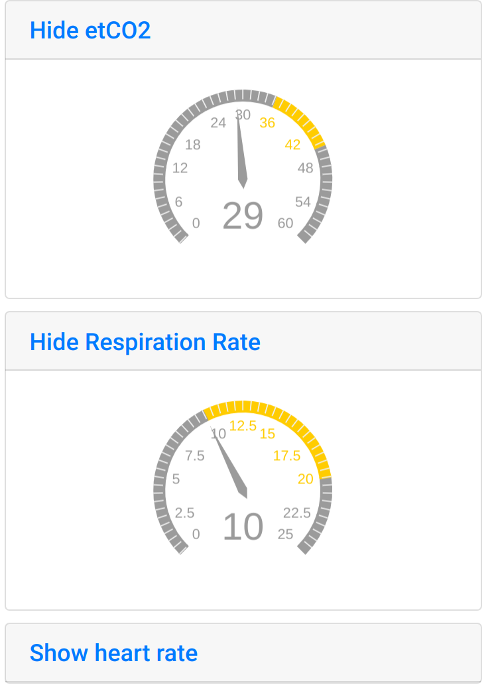
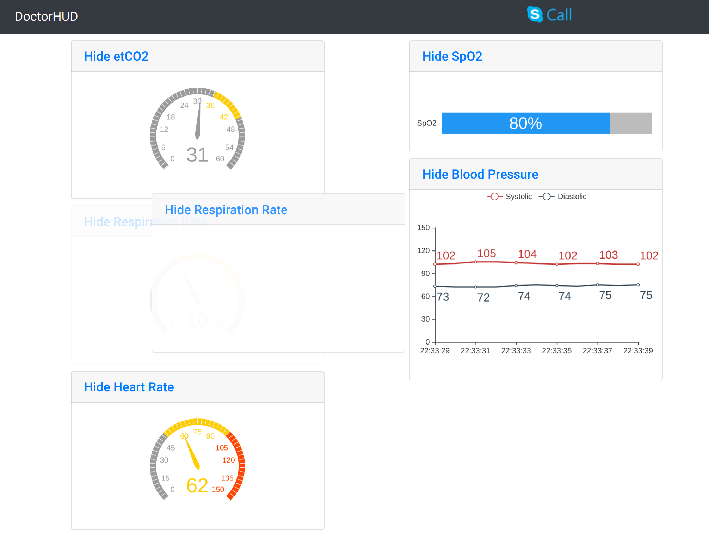

Remote Doctor Operation
=======================

The major functionality of the remote doctor's web interface can be explained over a few different operations.

Connect Page
------------
Everything starts at the `connect page <https://jlipworth.github.io/doctor-hud>`_. This is a drop-down to select what server we want to go to. It includes our online demo server, and a local option for users wanting to test it on their own machines.

.. image:: pictures/connectpage.png
   :align: center

Creating Account
----------------
To create permanent credentials as a doctor, a new account should be made. This can reached through the login page.

.. image:: pictures/login-create.png
   :align: center

Filling this form and submitting it will store these credentials to be used in the future.

Login via Credentials
---------------------
Logging in with credentials to a specific room requires a calendar slot to be setup in advance by an admin. If this has been setup, loggin in with credentials should bring the user directly to the sensor display for the particular room.

.. image:: pictures/login-credentials.png
   :align: center

Login via Token
---------------
When immediate assistance is required, sometimes there isn't enough time to assign a calendar slot, or setup a new account if the remote doctor does not have one yet. Admins can create temporary tokens for a specific room, which can be used in a different field at the login screen.

.. image:: pictures/login-token.png
   :align: center

Displaying + Hiding Sensors
---------------------------
The default display when first logged in is to display all the sensor data. If desired, the remote doctor can hide any of the sensors. Here is the default first column of sensors.

Clicking hide on the heart rate sensor will result in:

Clicking show will return the view back to the first view.

Moving Sensors
--------------
The sensors can be moved around in the two separate columns. The entire sensor window is drag and drop, so the remote doctor can easily customize the display as they desire.

Skype Integration
-----------------
<Fill in>

Logout
------
To logout of the session, click the logout button in the top banner:

.. image:: pictures/sensors-logout.png
   :align: center

If previously logged in with credentials, as long as the time is still within the calendar slot, the user can log back in.

If previously logged in with a temporary token, a new token will have to be generated to view again as the previous token has been used up.
